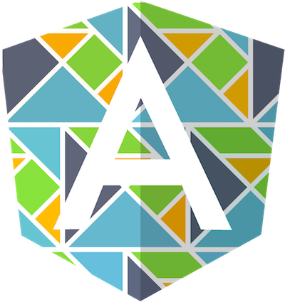

# AngularJS directive to include Elm modules

Use Elm modules in AngularJS applications, with ports interoperation.

## Usage

In your AngularJS template, put an HTML tag like this where you want the Elm application to live.

    <ng-elm module="..."></ng-elm>

Only the `module` attribute is required. Fill in `...` with the name of your Elm module.

### Embed an insular Elm module

Say you have this simple Elm module.

    module Hello exposing (main)

    import Html exposing (text)

    main =
        text "Hello from Elm!"

[Compile it](https://guide.elm-lang.org/install.html#elm-make) on the command line with `elm make Hello.elm --output=elm.js` and put that script in your AngularJS application's index.html. Then you can include the `Hello` module in any AngularJS HTML template.

    <ng-elm module="Hello"></ng-elm>

It works with deeply nested module names too.

    <ng-elm module="User.Support.Chat"></ng-elm>

These module names must appear under the global `Elm` object in JavaScript.

### Interfacing with AngularJS

The `ng-interface` HTML attribute is used both for passing [program flags](https://guide.elm-lang.org/interop/flags.html) to initialize your Elm app, and for [communicating via ports](https://guide.elm-lang.org/interop/ports.html).

There's a technical reason why it's rigged this way.

### With flags

If your Elm app does not use ports but requires only one flag, for instance a random seed or a date object, then you could pass that one value along.

    <ng-elm module="Game.Shuffler" ng-interface="gameCtrl.randomSeed"></ng-elm>
    <ng-elm module="FortuneTeller" ng-interface="mysticalController.today"></ng-elm>

For multiple flags pass an object, which could very well be your controller, or `$scope` if that's how you roll.

    <ng-elm module="Complex.Thingy" ng-interface="complexCtrl"></ng-elm>
    <ng-elm module="Some.Gizmo" ng-interface="gizmoCtrl.$scope"></ng-elm>

### Communicate with AngularJS via ports

Track properties and use subscription callbacks on a controller.

    <ng-elm module="My.Elm.Module" ng-interface="myAngularController"></ng-elm>

On a more deeply nested object.

    <ng-elm module="My.Elm.Module" ng-interface="myAngularController.$scope.elmPorts"></ng-elm>

#### Ports Interoperation

The object or controller you reference via the `ng-interface` HTML attribute must have properties that match the names of ports that send information to your Elm module. Similarly, to subscribe to updates coming out of your Elm module, you'll need callbacks whose names match each Elm-to-JS port.

For the following examples imagine an Elm module within your application that tracks the severity level of an alert. We'll set it up to communicate directly with an existing AngularJS controller like this:

    <ng-elm module="Alert" ng-interface="alertController"></ng-elm>

##### JS to Elm

If your Elm Alert module has an inbound port like so:

    port severity : (Int -> msg) -> Sub msg

Then your AngularJS alertController must have a property on it called `severity` that's an integer.

    this.severity = 0

The `ng-elm` directive watches that `severity` property on your AngularJS controller. When `severity` changes, if your Elm module is [subscribing](https://package.elm-lang.org/packages/elm/core/latest/Platform-Sub) to that port, then it will update with that information.

##### Elm to JS

If your Elm Alert module has an outbound port like so:

    port updatedSeverity : Int -> Cmd msg

Then your AngularJS controller must have a callback on it called `updatedSeverity` that accepts an integer.

    this.updatedSeverity = function(newSeverity) { this.severity = newSeverity }

### Both flags and ports

If your module uses both of these things to do its job, then the names of the ports and the flags' record keys must match.

    port greeting : (String -> msg) -> Sub msg
    port cheerfulnessFactor : (Float -> msg) -> Sub msg

    type alias Flags =
        { greeting : String, cheerfulnessFactor : Float }

Sorry, but this is due to a technical limitation.

## Installation

Run this on the command line.

    npm install --save angularjs-ng-elm

Include the directive script in your index.html.

    

Add the `Elm` dependency to your AngularJS app.

    var app = angular.module('app', ['Elm', 'other.dependency', ...])

## Support

Only version 0.19 of Elm is supported. Future versions of Elm may cause breaking changes. This will _not_ work with pre-0.19 versions of Elm.

Only [AngularJS 1.x](https://angularjs.org/) is supported. What that _x_ is, I dunno. Assume it's 1.7 or later. But it's not the [new Angular](https://angular.io/).

### Limitations

You can only have one instance of a given Elm module running at a time. So this won't work in the same HTML template.

    <ng-elm module="MultiplyMe"></ng-elm>
    <ng-elm module="MultiplyMe"></ng-elm>

But you can have as many different Elm modules as you want. This is fine.

    <ng-elm module="Buenos.Dias"></ng-elm>
    <ng-elm module="Konnichiwa"></ng-elm>
    <ng-elm module="Guten.Tag"></ng-elm>
    <ng-elm module="Bonjour"></ng-elm>

### Browsers

Check [Elm's browser support](https://discourse.elm-lang.org/t/elm-support-for-older-browsers-ie-9-10/744/7) if you support browsers older than Internet Exploder 9.

This doesn't have to do with the AngularJS directive, which should have the same browser compatibility as the version of AngularJS you're using.

## Intent

AngularJS is getting old. There are lots of mission-critical applications out there [built with this technology](https://www.madewithangular.com/), and they would benefit from modernization with a goal of higher maintainability. As experience has taught me, those applications are probably pock-marked with ugly bits of buggy code that nobody wants to refactor for fear of breaking things. They probably also have insignificant test coverage because AngularJS can be cumbersome to test.

Elm addresses both of these problems in ways TypeScript simply _can't_, but Elm needed an easy way to integrate itself into AngularJS applications.

So next time you encounter some AngularJS code that meets these criteria:

* Has at least one bug
* Makes all the developers in the room laugh at it _(not with it)_
* Needs updating because product management has bigger plans for it

then [fix that problem](https://elm-lang.org/blog/how-to-use-elm-at-work) with Elm.

## Credit

Originally created by [virasak](https://github.com/virasak/angular-elm) for Elm 0.18.

Ported to Elm 0.19 and modified with breaking changes by Ethan B. Martin.

Special thanks to [Paul](http://paulguardino.net) for the logo.
